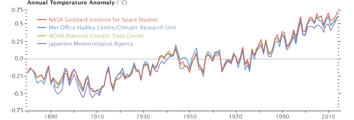
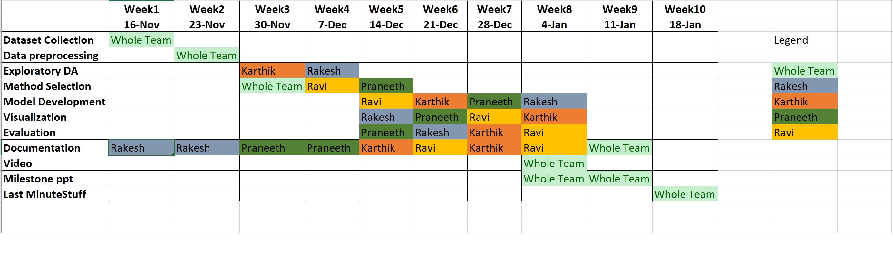

---
output:
  html_document: default
  pdf_document: default
  word_document: default
---
[//]: # (Code chunk here)

```{r setup, include=FALSE}
knitr::opts_chunk$set(echo = TRUE)
```
# Project Proposal

### Team WHOCares  
###### Karthik Kadajji, Praneet Chedella, Ravi Gunti, Rakesh Devalapally  

--------------------------------------------------------------------------------------------------
***

### Motivation

Global warming, a long-term rise in average temperatures on Earth's surface has been observed to rise since the 1950s. In 2013, the Intergovernmental Panel on Climate Change (IPCC) Fifth Assessment Report concluded, "It is extremely likely that human influence has been the dominant cause of the observed warming since the mid-20th century." Climate models available now also predict that the Earth's global annual average temperature will rise by at least 0.2&deg;C for the next 2 decades. However, by looking at the data available, there were some dips in the graph of observed average temperatures during few years. What could be causing this anamoly? Is it because of the decrease in CO2 emissions? If so, what is causing the decrease in CO2 emissions? And if it is not the case, what could it be?

  


###### Source https://earthobservatory.nasa.gov/WorldOfChange/DecadalTemp

### Project Objectives
* Is it possible that there are more factors contributing to the dip in average temperatues ?  
* Is it just CO2 emissions? What could cause CO2 emissions? - Considering that industrialization is correlated to GDP, did the presence of more industries led to more emission of CO2? 
* How much did deforestation play a role in contributing to increase in CO2 emission? 
* Do other Natural calamities also contribute?  
* Could it be possible that the number of humans on the face of the planet has any correlation with the temperature dip?

### Name(s) of Datasets we will use
* Global Temperatures dataset    
* Global CO2 emission level dataset  
* GDP Dataset  
* [Human population dataset](https://www.indexmundi.com/)  
* [Natural disasters](https://www.emdat.be/)  
* [Significant Earthquake Dataset](https://www.ngdc.noaa.gov/nndc/struts/form?t=101650&s=1&d=1)
* [Global Terrorism Database](https://www.start.umd.edu/gtd/contact/)
 

### Design Overview
Correlation techniques  
Predicting techniques  
Extrapolating techniques


### Project Timeline
  